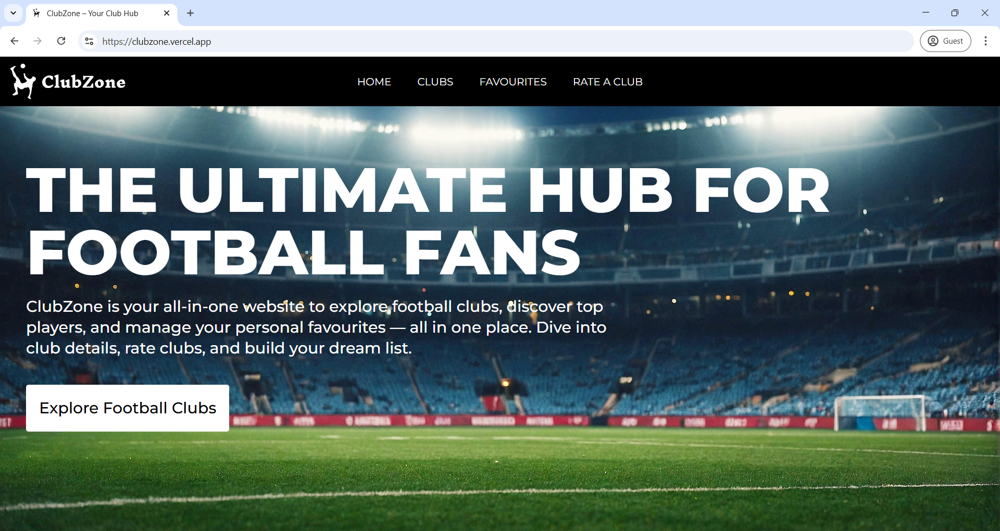
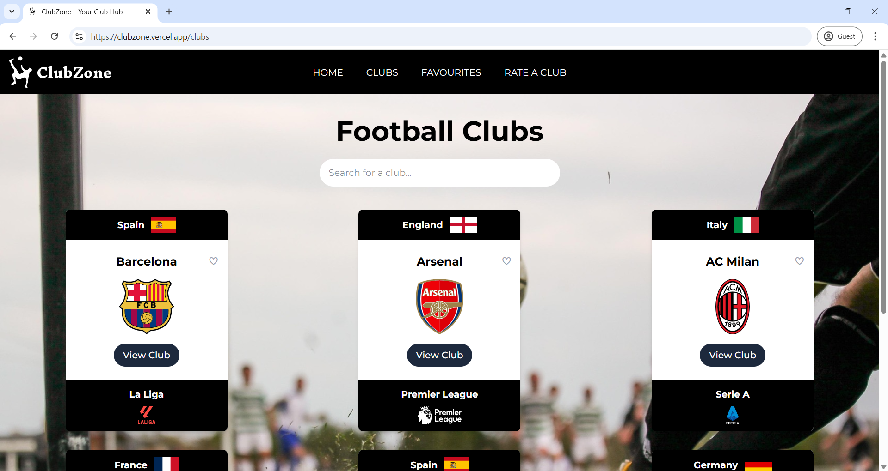
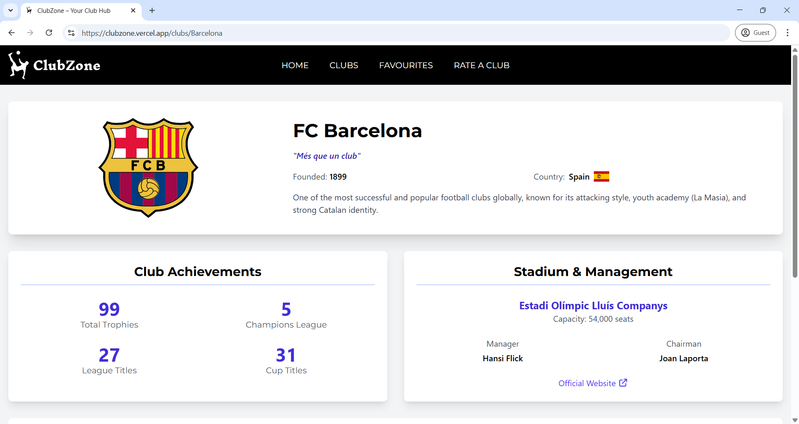
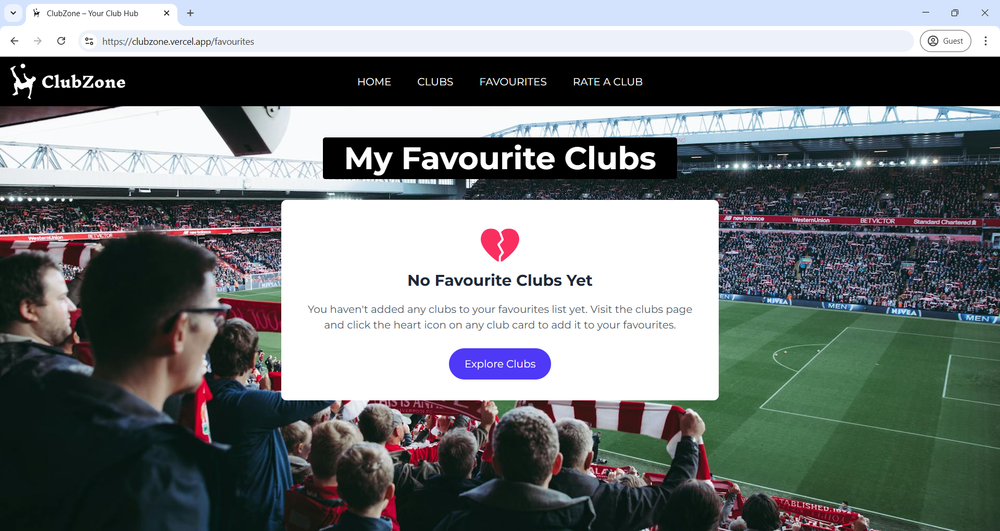
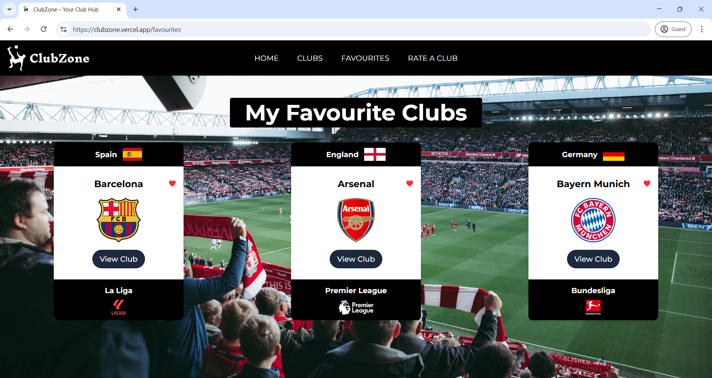
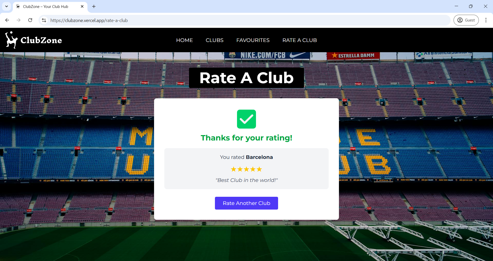

# ⚽ ClubZone – Your Club Hub


> Click [here](https://www.figma.com/design/SdTnOobC09kkZEdM7mLRw6/ClubZone-Logo) to view the Figma design for the above logo

## 📸 Screenshots

### Homepage



### Clubs Page



### Club Details Page



### Favourites Page (Before)



### Favourites Page (After)



### Rating Page



## 📄 Description

**ClubZone** is a website that allows users to explore the top football clubs, view detailed information about them and manage their personal favourites. Users can also rate their favourite football club.

The website is live on [https://clubzone.vercel.app/](https://clubzone.vercel.app/)

---

## ✨ Features

- Browse a collection of top football clubs
- View detailed club stats, stadium info, and current player lineup
- Mark and unmark favourite clubs
- Dedicated **Favourites** page to view all marked clubs
- Rate your favourite football club
- Responsive design for desktop and mobile

---

## 🔧 Tech Stack

- **React** (Vite)
- **React Router DOM**
- **Context API**
- **Tailwind CSS**
- **Local JSON (mock data)**

---

## 🚀 Setup Instructions

1. **Clone the repository:**

```bash
git clone https://github.com/brixdorf/ClubZone.git
cd ClubZone
```

2. **Install dependencies:**

```bash
npm install
```

3. **Start the development server:**

```bash
npm run dev
```

---

</> with lots of efforts by [**Romit Raj Sahu**](https://github.com/brixdorf/)

> **P.S.**: I have lost count of how many times I got the results for American Football instead of the actual one while finding resources for my project 😂